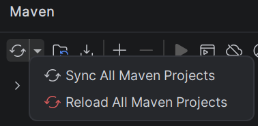

# Trabajo Práctico Interprete con ANTLR

Trabajo práctico universitario en el que se implementó un intérprete para un lenguaje de programación simple utilizando ANTLR4 y Java.

## Integrantes del grupo
| Nombre | Apellido|
| --- | --- |
|Ángel Valentín| Altieri |
| Evelyn | Paez |


## Variante asignada

La variante implementada por el grupo fue la sentencia `for`.

## Descripción del lenguaje

El lenguaje está pensado para escribir programas pequeños y simples con sintaxis en español. El programa comienza con la palabra reservada `programa`, seguida de un identificador y un bloque delimitado por llaves.

El intérprete soporta:

- Declaración de variables con `variable`.
- Asignación de valores con `=`.
- Impresión por pantalla con `mostrar(...)`.
- Condicionales con `si (...) { ... } sino { ... }`.
- Ciclos `para (...) { ... }`.
- Expresiones aritméticas, comparaciones y operadores lógicos.
- Literales enteros, reales, booleanos y cadenas de texto.
- Comentarios de una línea con `//` y de varias líneas con `/* ... */`.

### Ejemplo de estructura general

```text
programa ejemplo {
	variable i;
	i = 2*3+5;
	mostrar(i);
}
```

## Decisiones de diseño

- Se utilizó ANTLR4 para facilitar la implementación del patrón interprete y separar el análisis léxico y sintáctico del análisis semántico.
- La semántica se resolvió con el patrón Visitor, a través de `SimpleCustomVisitor`, donde también se manejaron errores semanticos.
- Se mantuvo una tabla de símbolos para registrar valores y una tabla de tipos para validar asignaciones e incompatibilidades.
- Se implementaron errores léxicos, sintácticos y semanticos personalizados en español para dar mensajes más claros al usuario.
- Los tokens en el archivo ".g4" se definieron en orden de especificidad (más específicos primero) para evitar conflictos de reconocimiento en ANTLR.

## Requisitos previos

Para compilar y ejecutar el proyecto es necesario tener instalado:

- Java 11.0.31
- Maven

No hace falta instalar ANTLR manualmente en la máquina. Al ejecutar Maven, el plugin de ANTLR definido en el `pom.xml` se descarga y se usa automáticamente para generar el parser y el lexer.

## Compilación

El proyecto utiliza Maven. Desde la raíz del repositorio ejecutá:

```bash
mvn clean compile
```

Ese comando genera los archivos de ANTLR y compila el proyecto.
Luego ir a la sección de Maven y presionar el boton "Reload All Maven Projects"



## Ejecución

El punto de entrada principal es `com.tpinterprete.simple.interprete.Main`.

Desde el IDE, ejecutá esa clase y pasale como archivo de entrada un programa`.smp`. Si no se pasan argumentos, el intérprete toma por defecto el archivo `test/test_for_if.smp`, si se desea cambiar, en la linea 14 del archivo Main.java pasarle el nombre del archivo.

## Ejemplos de uso
Podes encontrar ejemplos de codigo en la carpeta test

